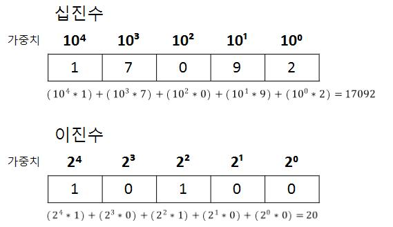
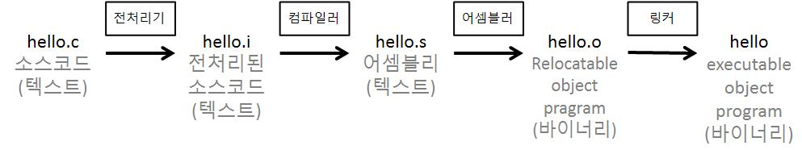
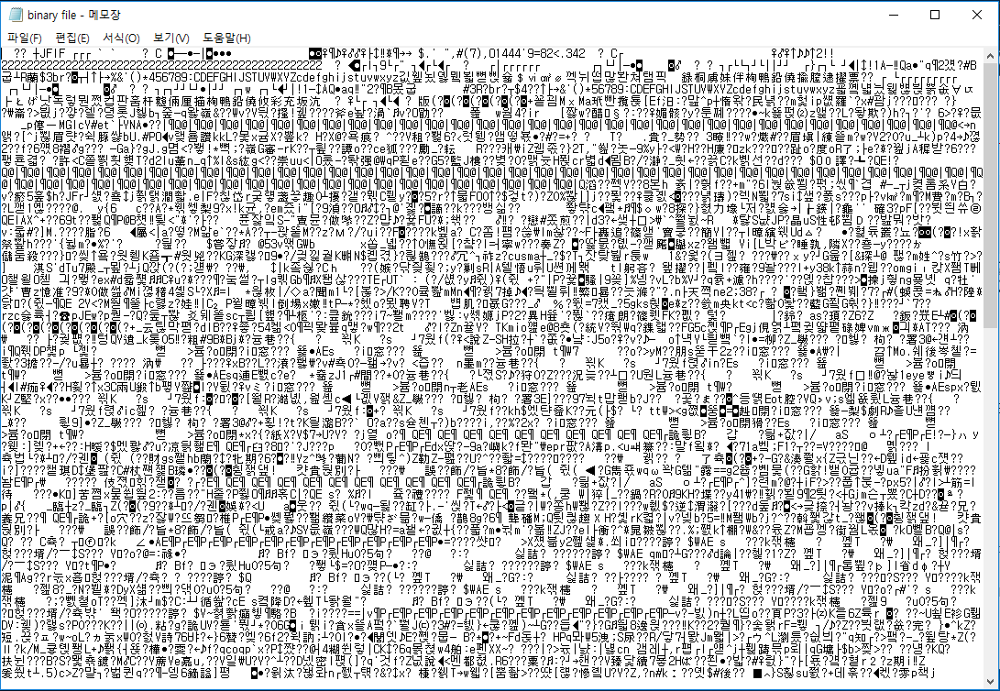

# 프로그램?

# 1. 모든 것이 비트(Bit)가 된다 - 이진수

컴퓨터는 0과 1밖에 모른다는 말은 많이들 들어보셨을 겁니다. 이 글을 읽을 정도의 분들이라면 그 0과 1이란 것이 진짜로 컴퓨터 안에 ‘0’과 ‘1’이 써있는 게 아니라 전자가 있고(1) 없음(0)을 의미한다는 것도 어디선가 들어보셨을 것 같네요. 사실 전자가 있는 게 1이고 없는 게 0이란 사실은 별로 중요하지 않습니다. 전자가 있는 것을 0이라고 하고 없는 것을 1이라고 해도 상관은 없어요. 심지어는 숫자가 아닌 ↑, ↓여도 좋습니다. 중요한 것은 컴퓨터가 전자가 있고 없는 두 가지 상태만을 가지고 모든 일들을 처리한다는 것입니다. (편의상 전자가 있는 상태를 1, 없는 상태를 0으로 표기하는 보편적인 표기를 따르겠습니다)

컴퓨터에서 정보를 저장하면 내부적으로는 0과 1로 저장이 됩니다. 컴퓨터에서 연산을 하면 내부적으로는 0과 1의 연산이 이루어집니다. 심지어 다른 컴퓨터로 정보를 전송할 때에도 0과 1로 보내집니다.

이 0과 1을 담을 수 있는 최소 단위의 표현을 비트(Bit, Binary digit)라고 합니다. Binary digit을 한국말로 직역하면 ‘이진 숫자’ 정도가 되겠네요. 이는 우리가 일반적으로 사용하는 십진 숫자를 생각해보면 이해가 빠릅니다. 우리는 총 10개의 상태를 0부터 9까지의 숫자를 사용하여 표현할 수 있습니다. 이와 똑같이 이진 숫자로는 두 가지 상태를 0과 1 두 숫자로 표현할 수 있는 것이지요.

하지만 0과 1만으로 세상의 수많은 것들을 표현하기는 벅차죠. 당장 영어 알파벳만 해도 대소문자 합해서 52자입니다. 그래서 십진수와 같이 숫자 여러 개를 일렬로 나열한 후, 숫자의 위치에 따라 가중치를 두어 하나의 Bit로 표현하지 못하는 수를 표현합니다. 이것이 이진수입니다.



컴퓨터는 8개의 비트를 일렬로 묶은 바이트(Byte)를 정보의 최소 단위로 사용합니다. 1바이트에는 00000000부터 11111111까지, 십진수로는 0부터 255(, 또는 )까지 저장할 수 있죠. 물론 여러 개의 바이트를 묶어서 255보다 큰 수를 저장하는 것도 가능합니다.

여러분은 지금 “컴퓨터는 0과 1밖에 모른다”는 말의 의미를 깨달았습니다. 이는 곧 “컴퓨터는 이진수밖에 모른다”를 의미합니다. 즉 컴퓨터의 모든 정보는 그것이 숫자든 문자든 프로그램이든 여튼 이진수로 저장되고 다루어 진다는 것입니다. 본질적으로 컴퓨터는 이진수를 연산하는 계산기입니다.

>❓  
>컴퓨터가 어떻게 이진수를 저장하고 계산하는지 궁금하실겁니다. 하지만 그런 내용들은 이 시리즈에서 다루기에는 지나치게 하드웨어와 가깝다고 판단되어 다루지 않겠습니다. 컴퓨터가 이진수를 물리적으로 저장하고 계산하는 것은 하드웨어적으로 잘 추상화 되어서 우리가 물리적인 지식 없이도 컴퓨터를 이해할 수 있게 해줍니다. 그러나 정말로 컴퓨터의 작동을 밑바닥부터 이해하고 싶으시다면 아래의 두 책을 추천드립니다.
>
>『*Code: The Hidden Language of Computer Hardware and Software*』 - Charles Petzold  
>『*The Elements of Computing Systems*』 - Noam Nisan, Shimon Schocken
>
>두 책 모두 『CODE』, 『밑바닥부터 만드는 컴퓨팅 시스템』이라는 제목으로 국내에 출간되었으며, 번역도 양호합니다. 부담없이 읽을 수 있는 난이도의 이론적인 설명을 원하시면 『CODE』를, 난이도는 있지만 실전적인 이해를 원하시면 『밑바닥부터 만드는 컴퓨팅 시스템』을 읽어보시는 것을 추천드립니다. 후자의 경우 [공식 사이트](https://www.nand2tetris.org/)도 있으니 살펴보시면 좋을 것입니다.


## 1-1. 십육진법(Hexadecimal)


앞으로 우리는 컴퓨터 시스템을 다루며 수많은 이진수를 접하게 될 것입니다. 그런데 이진수는 길이가 길어 읽기 어렵다는 문제점이 있습니다. C에서 int형 변수는 4바이트를 차지하는데, int형 변수 하나 표기할 때 마다 32개의 비트를 하나하나 표기하면 쓰기도 읽기도 힘들죠.

```c
int a = 1024; // 00000000 00000000 00000100 00000000
int b = 125;  // 00000000 00000000 00000000 01111101
```

이러한 이유로 이진수를 표기할 때에는 편의상 4개의 비트를 하나로 묶어서 한 자리에 표기하는 경우가 많습니다. 이 경우 하나의 자릿수는 0부터 15()까지 총 16개의 경우를 한 자리에 표기할 수 있게 되고, 이를 십육진법이라고 합니다. 0부터 9까지는 십진수의 숫자와 동일하게 표기하고, 10부터 15까지는 영문자 a부터 f까지를 사용하여 표기합니다. 또한 십육진법 수임을 명시하기 위해 수 앞에 0x를 붙여 표기하는 경우가 많습니다.

| 십진수 | 이진수 | 십육진수 |
| --- | --- | --- |
| 0 | 0000 | 0 |
| 1 | 0001 | 1 |
| 2 | 0010 | 2 |
| 3 | 0011 | 3 |
| 4 | 0100 | 4 |
| 5 | 0101 | 5 |
| 6 | 0110 | 6 |
| 7 | 0111 | 7 |
| 8 | 1000 | 8 |
| 9 | 1001 | 9 |
| 10 | 1010 | a |
| 11 | 1011 | b |
| 12 | 1100 | c |
| 13 | 1101 | d |
| 14 | 1110 | e |
| 15 | 1111 | f |

이를 이용하여 위에서 a, b에 할당된 값을 다시 적으면 아래와 같습니다. 아래의 16진수가 해당하는 10진수가 맞는지는 n번째 자리 숫자의 가중치를 로 잡고 위에서 이진수의 십진수 값을 계산한 것과 같이 계산하면 확인할 수 있습니다.

```c
int a = 1024; // 0x00000400
int b = 125;  // 0x0000007d
```

# 2. 프로그램

컴퓨터가 수많은 종류의 파일들을 숫자로만 저장한다는 사실은 상당히 놀라운 사실이지만, 컴퓨터의 작동 원리를 살펴보는데 집중하기 위하여 일단은 실행 가능한 프로그램 파일이 어떻게 만들어지는지 살펴보겠습니다. 

## 2-1. 소스코드

아래와 같은 C언어로 작성된 소스 코드가 있습니다. 

```c
// hello.c

1 #include <stdio.h>
2
3 int main()
4 {
5     printf("hello, world\n");
6     return 0;
7 }
```

이 코드 역시 컴퓨터에 이진수로 저장됩니다. 일반적으로는 ASCII라는 인코딩 규칙을 따라서 저장되는데, 각 문자와 수를 1대 1로 대응시켜 저장하게 됩니다.


위의 ASCII 표를 따라 소스 코드가 저장되는 경우 hello.h의 첫 줄은 아래와 같이 저장됩니다.

```c
// #include <stdio.h>
23 69 6e 63 6c 75 64 65 20 // #include(공백문자)
3c 73 74 64 69 6f 2f 68 3e // <stdio.h>
```


>💡  
>문자 인코딩에는 ASCII 뿐만 아니라 UTF-8, UTF-16, EBCDIC 등 다양한 방식들이 있습니다. ASCII는 영문자 외의 문자 표기가 제한되기에 다양한 언어 지원을 위해 ASCII에서 확장된 인코딩 방식들도 상당 수 존재하며, 이들을 통틀어 ASCII라고 부르기도 합니다.


>💡  
>문자 인코딩 방식을 따라 저장된 파일을 ‘텍스트 파일’이라고 부릅니다. 이와 구분하여, 문자 인코딩 과정을 거치지 않고 저장된 텍스트 파일이 아닌 모든 파일들을 ‘바이너리(binary) 파일’이라고 부릅니다.

## 2-2. 컴파일

컴퓨터가 우리가 작성한 소스 코드를 알아서 읽고 실행시켜주면 좋겠지만, 아쉽게도 이는 불가능합니다. 컴퓨터가 이해할 수 있는 기계어는 C와 같은 고급 언어와 완전히 다르게 생겼기 때문이죠. 세상의 수많은 프로그래밍 언어들을 알아서 읽고 작동하는 것은 본질적으로 이진수 계산기인 컴퓨터가 하기에는 벅찬 일입니다.

그러므로 우리가 작성한 hello.c 소스 코드를 컴퓨터가 실행하기 위해서는 컴퓨터가 이해할 수 있는 기계어로의 번역이 필요하며, 이 과정을 컴파일(compile)이라고 합니다. 여기서는 C언어가 gcc 컴파일러를 통해 컴파일 되는 과정을 따라가며 실행 가능한 바이너리 파일, 즉 프로그램이 어떻게 만들어지는지 살펴봅시다.

```bash
> gcc -o hello hello.c
```




>❓  
>지금껏 신경 써본 적도 없는 컴파일 과정을 우리가 왜 알아야 하는지 의문을 가지는 분도 있을 것 같습니다. 하지만 컴파일 과정을 이해하는 것은 우리에게 상상 이상의 이점을 가져다 줍니다. 대표적인 이점 세 가지만 꼽아보죠.
>
>1. 프로그램 최적화를 위한 기반 지식이 됩니다. ‘switch’문은 거의 언제나 연속된 ‘if-else’문보다 효율적이라는 사실을 아시나요? 함수 호출로 인한 오버헤드에 대해 들어보셨나요? 왜 지역 변수에 대한 접근이 call by reference보다 훨씬 빠를까요? 이런 지식들은 컴파일 과정에 대한 이해가 필수적으로 동반됩니다.
>
>2. 링킹 에러를 해결하기 위해 참고할만한 지식이 됩니다. visual studio로 코딩하시다가 LNK2019에러가 나신 경험이 있나요? 언제나처럼 무슨 에러인지 구글링 해봐도 원인이 너무나 다양해서 해결하기 난감한 에러이죠. 링킹 에러에 효과적으로 대처하기 위해서는, 매번 수많은 에러 발생 케이스들을 뒤져보기 보다는 컴파일러의 작동 원리를 알고 자신이 작성한 프로그램을 분석할 줄 알아야 합니다.
>
>3. 보안 취약점을 피하기 위해서입니다. 보안을 위해서는 데이터들이 어떻게 저장되고, 컴퓨터가 제어되는지 알아야 합니다. 이를 위해선 프로그램 스택에 어떻게 데이터가 저장되는지 정도는 필수적으로 꿰고 있어야 하고, 그러려면 프로그램이 생성되는 과정을 알아야 프로그램을 분석하든 어쩌든 하겠죠!

</aside>

### 2-2-1. 전처리(Preprocessing phase)

전처리기는 소스 코드의 # 문자로 시작하는 명령들을 처리합니다. 대표적인 전처리기에서 처리되는 명령어는 include, define 등이 있습니다.

```c
#include <stdio.h> // 이 위치에 stdio.h 헤더파일을 그대로 붙여넣습니다

#define ARRAY_LENGTH 10 // ARRAY_LENGTH를 10으로 바꿉니다
```

전처리 과정을 마치면 소스 코드와 같이 C언어로 작성된 텍스트 파일이 작성되며, 이 파일은 .i 확장자가 뒤에 붙습니다.

### 2-2-2. 컴파일(Compilation phase)

전처리부터 링킹 과정까지를 실행하는 프로그램을 컴파일러라고도 부르지만, 좁은 의미에서 컴파일러는 이 단계를 진행하는 프로그램을 의미하기도 합니다. 컴파일러는 전처리된 C 프로그램을 어셈블리로 작성된 프로그램으로 변환합니다. 어셈블리는 기계어와 1대 1 대응되는 저급 언어로, 우리가 컴퓨터 시스템을 이해하기 위해 필수적으로 이해해야 할 개념 중 하나입니다. 전처리 과정에서 생성된 hello.i를 어셈블리로 컴파일한 결과물에서 main 함수는 아래와 같이 나타납니다.

```c
1 main:
2     subq $8, %rsp
3     movl $.LCO, %edi
4     call puts
5     movl $0, %eax
6     addq $8, %rsp
7     ret
```

위의 어셈블리 프로그램 한 줄은 기계어 명령어 하나와 1대 1로 대응됩니다. 어셈블리어에 대해서는 추후에 자세히 다루어보도록 하겠습니다.

컴파일 과정을 마치면 어셈블리어로 작성된 텍스트 파일이 저장되며, 이 파일은 .s 확장자가 뒤에 붙습니다.

### 2-2-3. 어셈블리(Assembly phase)

컴파일을 마치면 어셈블리어로 작성된 텍스트 파일이 저장된다고 했죠. 어셈블리어는 기계어와 1대 1 대응되는 저급 언어이지만, 여전히 텍스트 파일이기 때문에 컴퓨터가 기계어로 이해하고 실행할 수는 없습니다. 즉, 어셈블리로 작성된 텍스트 파일을 기계어로 작성된 바이너리 파일로 변환해줄 필요가 있는거죠. 이 과정은 어셈블러(Assembler)가 수행하게 되고, 그 결과로 relocatable object program이 생성됩니다.

Relocatable object program이란 프로그램의 작동에 대한 기초적인 틀은 가지고 있으나 실제 물리적인 메모리 주소값과 소스 코드 외부 함수 등의 메모리 주소값이 비어있어 정상적인 작동은 불가능한 프로그램을 의미합니다. 이런 비어있는 정보들은 이 다음 단계인 linking 단계에서 수행하게 됩니다.


>💡  
>사실 컴퓨터는 텍스트 파일과 바이너리 파일을 구분하지 않습니다. 아니, 구분하지 못합니다. 어짜피 둘 다 이진수 값으로 저장되어 있기는 매한가지이기 때문이죠. 그렇기에 바이너리 파일을 텍스트 에디터로 열어도 열리기는 합니다. 다만 그럴 경우 문자에 대응되지 않는 수많은 숫자들과 텍스트로써 의미 없는 값들이 나열되어 있기에 이상한 문자들이 출력됩니다.
>
>

우리의 hello.s를 어셈블러가 바이너리 파일로 변환하면 main 함수는 총 17 바이트의 기계어로 번역됩니다.  

### 2-2-4. 링킹(Linking phase)

Relocatable object program에서 비어있는 정보들은 이 링킹 단계에서 채워지게 됩니다. 예를 들어 hello.c에 사용된 printf 함수의 경우, C 표준 라이브러리에 정의된 함수입니다. 이는 컴파일러에 의해 제공되며, 우리의 hello.o와 같이 printf.o라는 relocatable object program으로 존재합니다. 링커(linker)는 이러한 relocatable object program들을 하나로 묶어 executable object program, 즉 우리가 원하는 실행 가능한 프로그램으로 만들어줍니다. 소스 코드가 여러 개인 경우에도 relocatable object program은 여러 개가 생성되는데, 이를 묶어주는 것 역시 링커입니다. 링킹 과정에서 비어있던 코드 외부 함수들의 주소와 실제 물리적인 메모리 주소 정보가 저장되며, 결과로 실행 가능한 프로그램 hello가 저장됩니다. 


>💡  
>모든 컴파일 과정이 여기서 설명한 C 언어의 컴파일 과정과 같은 것은 아닙니다. Java의 경우는 중간 바이트 코드로 번역한 뒤 자바 가상 머신에서 중간 코드를 해석해서 프로그램을 실행시킵니다. 또한 인터프리터 언어(Python, Javascript 등)들은 컴파일이 필요 없이 소스코드를 실행 시간에 한 줄 한 줄 번역해서 실행합니다. JIT 컴파일의 경우 인터프리터 언어와 컴파일 언어 실행 과정의 중간에 위치한 컴파일 방법으로, 실행 시간에 실시간으로 컴파일을 진행합니다.

# 3. 마무리!

이번 글에서는 컴퓨터가 어떤 형식으로 정보를 다루며, 컴퓨터가 다루는 수많은 형식의 파일들 중 실행 가능한 프로그램이 어떻게 만들어지는지 알아보았습니다. 이는 이 시리즈가 ‘프로그래머를 위한 컴퓨터 시스템’인 만큼, 프로그램을 컴퓨터가 처리하는 방법에 집중하기 위해서입니다.

이제 실행 가능한 프로그램이 생성되었습니다! 프로그램이란 결국 기계어가 순서대로 나열되어 있는 바이너리 파일이란 것도 이제 우리는 압니다. 다음 시간에는 컴퓨터가 어떻게 프로그램을 실행시키는지 하드웨어에 한 발짝 다가가서 알아보도록 하겠습니다.
