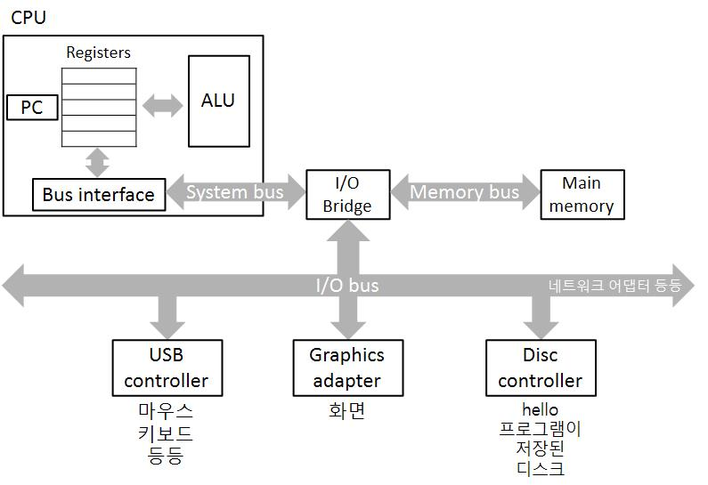
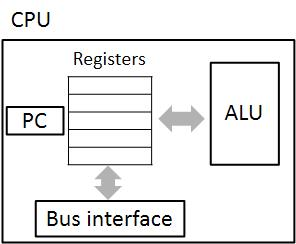
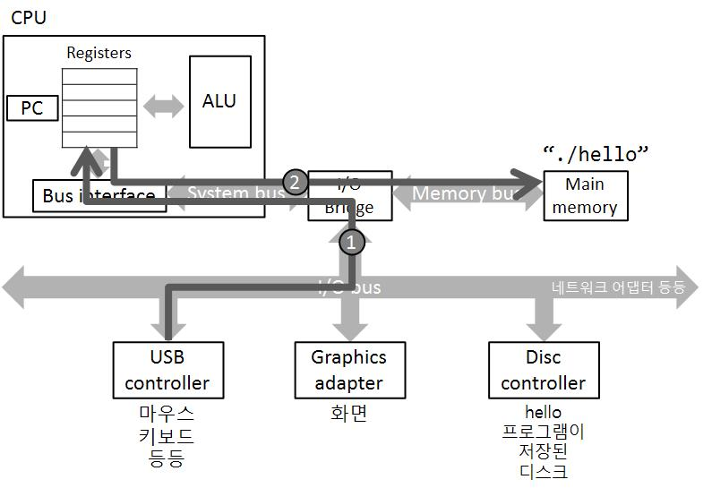
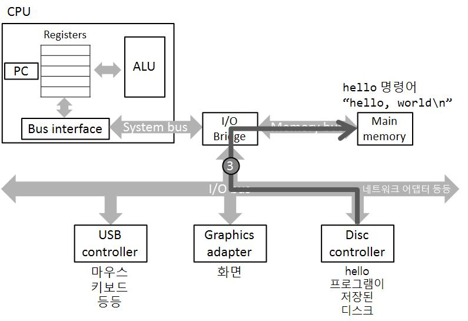
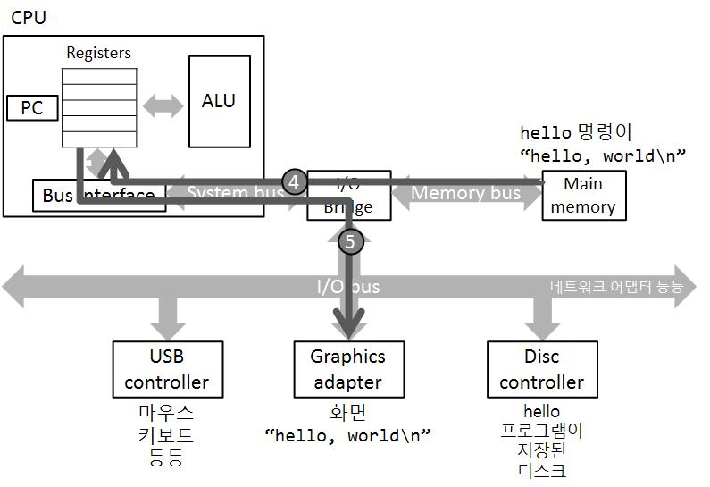

# 컴퓨터는 어떻게 프로그램을 실행하지?

# 1. 하드웨어 뜯어보기


이전 글에서는 C 소스 코드로부터 실행 가능한 프로그램을 생성하는 과정을 살펴봤습니다. 이번 글에서는 하드웨어에 한 발짝 다가가 우리가 생성한 프로그램이 하드웨어 상에서 어떤 과정을 걸쳐 실행되는지 알아보겠습니다. 하지만 그러려면 일단 하드웨어에 어떤 것들이 있는지 알아야겠죠? 하나씩 알아봅시다.



## 버스(Buses)

버스는 전기 신호가 흐르는 길들의 집합입니다. 버스를 통해 각각의 컴퓨터 구성 요소들이 바이트들을 주고 받죠. 이들은 한 번에 word라고 불리는 고정된 크기의 바이트 묶음을 전송할 수 있도록 설계됩니다. 하나의 word 안에 들어있는 바이트의 수(이하 **word size**, 워드 크기)는 컴퓨터가 한 번에 처리할 수 있는 정보의 양을 결정하기에 컴퓨터 시스템에서 아주 중요한 하드웨어적 변수입니다. 오늘날 대부분의 하드웨어는 32비트(4byte) 또는 64비트(8byte)의 word size를 가지는 버스를 사용합니다.

버스는 현실의 차선과 연결지어 생각하면 이해가 빠릅니다. 하나의 차선은 하나의 비트가 다니는 길입니다. 두 개 이상의 비트가 하나의 길을 공유할 수는 없습니다. (0과 1을 전기가 흐르지 않는 상태와 흐르는 상태로 구별하기 때문이죠. 하나의 선로에 전기가 흐르면서 동시에 안 흐를수는 없습니다.) 8차로에서는 총 8개의 비트, 즉 1 바이트를 한번에 보낼 수 있습니다. 32차로에서는 4바이트를 동시에 보낼 수 있죠.

## 입출력 장치(I/O Devices)

입출력 장치는 컴퓨터 시스템이 외부 세계와 연결되도록 합니다. 위의 이미지에서는 user input을 위한 키보드와 마우스, user output을 위한 화면, 데이터의 장기 저장을 위한 디스크 드라이브가 이에 해당합니다. (우리의 hello 프로그램도 디스크 드라이브에 저장되어 있습니다)

각 입출력 장치는 **controller**, 혹은 **adapter**를 통해 I/O 버스에 연결됩니다. 이 둘은 모두 I/O 버스와 I/O 장치 간에 정보를 전송하는 역할을 수행하지만, 메인보드 그 자체의 일부로 포함되어 있을 경우 controller, 메인보드의 슬롯에 장착되어 작동하는 경우 adapter라고 불립니다. 


> ❓  
> 정보 저장을 위한 디스크 드라이브가 컴퓨터의 핵심 구성 요소가 아니라 입출력 장치에 포함된다는 사실이 어색하게 느껴지실 수도 있습니다. 디스크 드라이브, CD-ROM, DVD 등 정보 저장을 위한 장치들을 **storage device**라고 부릅니다. 이들은 사용자와의 input/output을 직접적으로 수행하지 않기 때문에 종종 입출력 장치가 아닌 것으로 생각되기도 합니다.
>
>그러나 컴퓨터 구조에 한층 더 가까워져 생각해본다면, 입출력 장치는 CPU, 그리고 메모리와 input/output을 수행하는 장치로 이해됩니다. 이러한 관점에서 보면 대부분의 storage device들은 이들과 input/output을 수행하기에 입출력 장치로 볼 수 있죠. 현대 컴퓨터의 대부분이 따르는 폰 노이만 구조(Von Neumann architecture)를 그린 위키백과의 그림을 보면 이해가 빠르실겁니다.
>
>
>

## 주 메모리(Main Memory)

주 메모리(이하 메모리)는 어떤 프로그램이 실행되는 동안 프로그램과 데이터가 일시적으로 저장되는 장치입니다. 메모리는 물리적으로는 dynamic random access memory(DRAM)들의 집합이며, 논리적으로는 선형으로 나열된 0부터 시작하는 주소값을 가지는 바이트들의 배열입니다. C 프로그램에서 선언된 변수들은 그 타입에 따라 메모리에서 다른 크기의 바이트를 차지합니다. 예를 들어 많은 경우 short는 2바이트, int와 float은 4바이트, long long과 double은 8바이트의 크기를 가집니다. 


>💡
>DRAM과 비슷하게 정보 저장을 위해 주로 캐시 메모리와 레지스터에 사용되는 SRAM(static ramdom access memory)도 있습니다. 지금은 DRAM은 싸고, 느리고, 많은 양의 정보를 저장할 수 있으며, SRAM은 이와 반대로 비싸고, 빠르고, 용량이 적다는 것만 알고 넘어가셔도 될 것 같습니다. 이 둘의 차이는 앞으로 이야기 할 기회가 있을 것입니다.

## CPU(Processor)

Central processing unit(중앙 처리 장치, CPU)는 메모리에 저장된 명령어를 해석-실행하는 컴퓨터의 두뇌이자 엔진과 같은 부분입니다. 그 만큼 다른 부분들보다 집중해서 볼 부분이 많으니 사진을 한 번 더 보고 갑시다.



### 프로그램 카운터(Program Counter, PC)

CPU의 작동을 가장 먼저 이해하기 위해 살펴봐야 할 부분은 프로그램 카운터(**program counter, PC**)입니다. PC는 word-size의 storage device로, 레지스터의 일종입니다. PC에는 다음에 실행할 주 메모리에 저장되어 있는 명령어의 주소값이 저장됩니다.

어떤 관점에서 보면 컴퓨터의 기본적인 작동은 상당히 단순합니다. 컴퓨터의 전원이 켜지고 꺼지기 전까지, CPU는 PC가 가리키고 있는 주소에 저장된 명령어를 실행시키고, 다음에 실행할 명령어의 주소값을 PC에 저장하는 작업을 반복합니다. 

### 레지스터 파일(Register File)

위에서부터 계속 레지스터, 레지스터 하는데 레지스터가 무엇인지 알아봅시다. 레지스터는 CPU 내부에 있는 아주 작고, 빠른 저장소입니다. 주로 빠르게 읽고 써야하는 임시적인 값들이 레지스터에 저장되죠. 레지스터 파일은 word-size 레지스터들의 집합으로, 레지스터 각각은 %eax, %ebp 등 고유한 이름을 가지고 있습니다.

### 산술 논리 장치(Arithmatic/Logic Unit, ALU)

ALU는 CPU에서 연산을 수행하는, 컴퓨터의 두뇌인 CPU에서도 가장 두뇌스러운 부분입니다. ALU가 수행하는 대부분의 연산들은 아래의 분류에 속합니다.

- Load: 주 메모리로부터 바이트/word를 레지스터로 불러옵니다. 기존에 레지스터에 저장되어 있던 값을 덮어 씌웁니다.
- Store: 레지스터로부터 바이트/word를 주 메모리에 저장합니다. 기존에 주 메모리에 저장되어 있던 값을 덮어 씌웁니다.
- Operate: 레지스터에 저장되어 있는 값을 대상으로 산술 또는 논리적인 연산을 수행합니다. 결과는 레지스터에 저장되며, 기존 값은 덮어 씌워집니다.  
- Jump: PC에 저장된 값을 새로운 값으로 덮어 씌웁니다.

### 명령어 집합 구조(Instruction Set Architecture, ISA)

하드웨어는 아니지만 CPU를 이해하기 위해 필수적으로 알아야 할 개념인 ISA에 대하여 알아봅시다. CPU는 위에서 본 것처럼 다양한 종류의 명령어를 읽고 실행할 수 있습니다. 그런데 세상의 모든 종류의 CPU가 같은 종류의 명령어를 실행하는 것은 아닙니다. 한 CPU에서 실행될 수 있는 명령어가 다른 CPU에서는 실행되지 못할 수도 있고, 반대로 한 CPU에서 실행되지 못하는 명령어가 다른 CPU에서는 실행될 수도 있습니다. 또 사용할 수 있는 명령어는 같더라도, 사용할 수 있는 레지스터가 다를 수도 있습니다. 세상에는 다양한 CPU가 존재하기 때문입니다.

ISA는 한 컴퓨터, 특히 CPU에 대한 추상화된 모델로, 한 컴퓨터에서 지원되는 명령어, 레지스터, 자료형 등의 정보를 정의합니다. 즉, 다른 종류의 CPU이더라도 같은 ISA를 따른다면 어떤 명령어에 대한 같은 실행 결과를 보장받을 수 있습니다.

### ISA와 Microarchitecture

오늘날의 CPU들은 프로그램 실행 속도를 높이기 위해 다양하고 복잡한 방법들을 사용합니다. 그렇기에 같은 명령어라도 그것을 수행하기 위한 물리적인 구현은 CPU마다 상이할 수 있다는 것이죠. 그렇기에 ISA는 명령어 실행을 위한 프로세서의 물리적인 구조를 기술하는 것이 아닌, 명령어의 실행 결과를 논리적으로 기술한 것으로 이해되어야 합니다. 그리고 ISA를 물리적으로 프로세서에 어떻게 적용했는지에 대한 CPU의 설계 구조를 우리는 microarchitecture라고 부릅니다.

# 2. 프로그램을 실행해봅시다


자! 컴퓨터가 무엇으로 구성되는지 알아봤으니 드디어 우리가 작성한 프로그램을 실행시킬 시간입니다.

```bash
> ./hello
```

위의 명령줄을 키보드로 하나하나 기입하면, Linux의 shell 프로그램이 각 글자를 레지스터로 읽어온 후, 주 메모리에 저장합니다.



엔터키를 입력하면 shell은 명령줄의 입력이 끝났다는 것을 인지합니다. 그 후 shell은 우리의 hello 프로그램을 디스크로부터 주 메모리로 복사합니다. 복사되는 데이터에는 실행시킬 명령어들은 물론이고 출력될 “hello, world\n” 문자열 역시 포함됩니다.

복사가 이루어지는 과정에서 하드 디스크에 저장된 데이터들은 CPU를 거치지 않고 바로 주 메모리로 이동하게 됩니다. 이는 direct memory access(DMA)라는 기술을 통해 가능합니다.



hello 파일의 코드와 데이터들이 주 메모리에 적재되면, CPU는 프로그램의 main 함수 루틴을 따라 명령어를 실행하기 시작합니다. 그 과정에서 “hello, world\n” 문자열을 화면에 출력해야 하는 상황이 되면, 주 메모리에 저장된 해당 문자열을 레지스터 파일로 복사한 후 화면에 출력하게 됩니다.



# 3. 마무리


이번 글에서는 컴퓨터를 구성하는 하드웨어에는 무엇이 있는지 알아보고, 프로그램의 실행 과정을 간략하게 살펴보았습니다. 프로그램 실행의 디테일한 부분은 쳐내고 설명하여 아직도 궁금한 부분이 많으시겠지만, 분명 각 단계들을 하나하나 뜯어서 설명할 기회가 있을테니 일단은 넘어갑시다. 이번 단원은 컴퓨터 시스템이 어떻게 작동하는가에 대한 큰 그림을 그리는 것이 목적이니까요.

이번 글을 읽으시며 혹시 이런 생각을 한 예리하신 분이 있을까 모르겠습니다.

> “뭐야? 프로그램 하나 실행하려고 뭘 이렇게 복사를 많이 해?”
> 

실재로 프로그램이 컴퓨터에서 실행되는 과정에서 값의 복사는 아주 빈번하게 나타납니다. 문제는 그 값의 복사가 더럽게 오래 걸려서 연산에 걸리는 시간보다 복사에 걸리는 시간이 압도적으로 길다는 것이죠. 다음 글에서는 이런 문제를 해결하기 위한 캐시와 메모리 계층 구조에 대해서 알아보겠습니다!