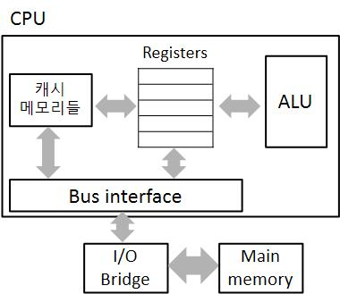
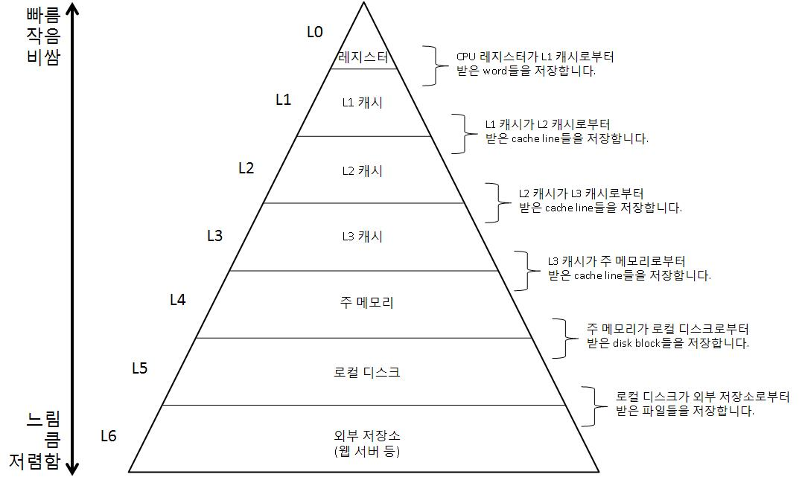

# 메모리가 CPU 따라가려다 다리 찢어집니다

# 1. 『느려』


프로그램의 실행은 필수적으로 수많은 값의 복사를 동반합니다. 프로그램 실행 과정의 대부분은 연산이 아닌 다른 장소로 정보를 복사하는 작업입니다. 심지어 그 작업은 끔찍하게 느리기까지 해서, 프로그램 실행 시간의 대부분을 복사에 사용하게 됩니다.


>❓  
>이런 생각을 하실 수도 있겠습니다.
>
> “값을 복사하는 게 연산보다는 간단할 것 같은데 느리면 얼마나 느리다고 그래요?”
> 
>
>네, 생각 이상으로 느립니다. 한 CPU의 가장 간단한 연산이 수행되는 시간을 1초라고 할 때, 주 메모리 접근은 대략 4분이 걸리며 하드 디스크로의 접근은 성능에 따라 1달에서 9달 정도가 걸립니다. [github.com](http://github.com) 서버로부터 제 컴퓨터로 웹페이지의 정보를 복사해오는 데에는 137년(현실 시간으로 1.73초)이 걸렸네요. 물론 컴퓨터마다, 환경마다 다르지만 데이터를 복사하는데 얼마나 오랜 시간이 걸리는지 감이 오시지요?


디크스에 저장된 프로그램과 데이터를 주 메모리로 복사하고, 주 메모리에서 프로세서로 명령어를 복사하고, 프로그램 실행을 위한 데이터들 역시 주 메모리에서 프로세서로 복사됩니다. 값을 연산하려고 복사를 하는 것인데, 배보다 배꼽이 더 크죠. 이러한 잦은 복사는 프로그램의 ‘진짜 작업’을 느리게 만드는 치명적인 오버헤드가 됩니다.


>💡  
>오버헤드에 대한 위키백과의 설명은 아래와 같습니다.
>
> **오버헤드**(overhead)는 어떤 처리를 하기 위해 들어가는 간접적인 처리 시간 · 메모리 등을 말한다.
> 
> 예를 들어 A라는 처리를 단순하게 실행한다면 10초 걸리는데, 안전성을 고려하고 부가적인 B라는 처리를 추가한 결과 처리시간이 15초 걸렸다면, 오버헤드는 5초가 된다.
> 


# 2. 캐시(cache) 메모리


물리적인 한계로, 큰 용량의 저장소는 작은 용량의 저장소보다 느릴 수 밖에 없습니다. 또한 장치들은 느리게 만들기보다 빠르게 만들기가 어렵고 비용도 더 들죠. 하드 디스크를 메모리보다 1,000배 더 큰 용량으로 만들 수 있지만, CPU가 값을 읽는 작업은 10,000,000배 더 느릴 수 있습니다. 비슷하게 레지스터 파일들의 용량은 주 메모리보다 수백만배 작지만, CPU가 값을 읽어들이는 속도는 수백배 더 빠릅니다.

컴퓨터가 만들어진 초창기에는 데이터의 복사 속도로 인한 병목 현상이 그렇게 중요하지는 않았습니다. 그러나 빠르게 작동하는 메모리보다 빠르게 작동하는 프로세서를 만드는 것이 더 싸고 쉬웠기 때문에, 프로세서-메모리 간극은 시간이 갈수록 커졌습니다. 그 결과 CPU의 빠른 연산 속도를 제대로 써먹기 위해 프로세서-메모리 간극을 해결하는 것이 절실해졌죠.

이 간극을 해결하기 위해 캐시 메모리(이하 캐시)가 등장하였습니다. 캐시는 주 메모리보다는 작고 빠른 저장소입니다. 가까운 미래에 CPU가 필요로 할 데이터들을 저장해두고, 프로세서가 필요로 할 때 데이터를 넘겨주는 것이죠. 당연히 주 메모리로부터 데이터를 읽어오는 것 보다 훨씬 빠릅니다.



캐시는 하나만 있지 않고, 용량과 속도가 다른 것들을 여러 개 가지고 있습니다. 그 각각을 빠르고, 용량이 작은 순으로 L1, L2, L3라고 부르죠.  

L1 캐시는 대략 수백 KB의 정보를 저장할 수 있으며, 접근 속도는 레지스터 파일들과 비슷하게 빠릅니다. L2 캐시는 그보다 10배 정도 많은 정보를 저장할 수 있고, 접근 속도는 L1 캐시 접근 속도의 5배 정도입니다. 하지만 그럼에도 주 메모리 접근보다는 5~10배 더 빠르죠. 최근의 CPU들은 L3 캐시도 가지고 있는 경우가 많습니다. 이는 역시 L2 캐시보다 더 크고 느리죠.

이러한 캐시들은 SRAM(static random access memory)로 만들어집니다. 이전 글에서 주 메모리는 DRAM으로 구성된다고 했었죠? SRAM은 DRAM보다 용량이 적지만 빠르다는 장점이 있습니다. 속도 향상을 위한 임시 저장소의 역할로는 DRAM보다 SRAM이 적격이겠지요.

## 2-1. 지역성(Locality)

캐시를 사용하여 프로그램을 빠르게 실행시키려면, 주 메모리에서 곧 쓰이게 될 데이터들을 캐시에 저장해두고 CPU는 캐시에 접근하여 데이터를 읽어오면 됩니다. 그런데 생각을 한 번 해보죠. 컴퓨터가 귀신도 아니고 어떻게 미래에 쓰일 데이터들을 예측해서 캐시에 저장해둘까요?

미래에 대한 답은 언제나 과거에 있습니다. 컴퓨터도 마찬가지로, 미래에 쓰일 데이터를 예측하기 위해 과거에 접근한 메모리를 참고하죠. 컴퓨터는 과거에 접근했던 데이터와, 물리적으로 그 근처 주소에 있는 데이터들을 캐시로 복사해둡니다. 시간적으로는 과거에 접근했던 데이터에, 공간적으로는 이전에 접근했던 데이터 근처의 데이터에 접근할 가능성이 높기 때문이죠. 그래서 아래의 두 코드 조각은 같은 실행 시간이 걸릴 것 같지만 사실은 위의 코드가 더 빠르게 실행됩니다.

```c
// 1번
for(i=0; i<100; i++)
{
	for(j=0; j<100; j++)
	{
		arr[i][j]=100;
	}
}
```

```c
// 2번
for(i=0; i<100; i++)
{
	for(j=0; j<100; j++)
	{
		arr[j][i]=100;
	}
}
```

왜냐하면 물리적으로 1번의 코드가 2번의 코드보다 물리적으로 좁은 지역에 위치한 데이터들에 집중적으로 접근하기 때문이죠. 좁은 지역에 밀집된 엑세스가 이루어지는 것입니다. 이를 **지역성(locality)** 이라고 합니다. 데이터를 캐시에 저장하는 작업은 CPU가 알아서 해주니, 우리 프로그래머들은 지역성을 최대화 할 수 있도록 코드를 작성해야 되겠지요? 지역성을 잘 이용하면 아주 큰 용량의 메모리를 아주 빠른 속도로, 주 메모리와 캐시 메모리의 장점 모두를 취하여 컴퓨터를 사용할 수 있게 됩니다.

# 3. 메모리 계층 구조(Memory Hierachy)


L1, L2, L3, 주 메모리... 점점 크고 느린 순으로 나열하니 마치 이들이 층을 이루고 있는 것처럼 느껴지지 않나요? 크고 느린 주 메모리와 프로세서 사이에 작고 빠른 캐시 메모리를 두어 속도를 향상시킨다는 사고를 일반화 시켜봅시다. 처리 속도의 차이를 해결하기 위해 중간 크기와 속도를 가지는 임시 저장소를 둔다는 생각으로 말이죠. 그러고서 컴퓨터 구조를 한 발짝 떨어져 관찰해보면, 컴퓨터 시스템 전체가 **메모리 계층 구조**를 이루고 있다는 것을 알 수 있습니다.



메모리 계층 구조의 뼈를 이루는 아이디어는 한 단계의 장치가 그 하위 단계 장치의 캐시 역할을 하는 것입니다. 레지스터는 L1 캐시의 캐시, L1 캐시는 L2 캐시의 캐시... 이런 식으로 가면 속도랑은 거리가 멀어 보이는 로컬 디스크 역시 웹 서버의 캐시 역할을 하게 됩니다.

위에서 지역성 개념을 통해 캐시에 대한 지식들이 프로그래머가 더 나은 프로그램을 작성하는데 도움을 줄 수 있다는 것을 알았죠. 메모리 계층 구조에 대한 지식 역시 같은 방식으로 프로그래머가 더 나은 성능의 프로그램을 작성할 수 있도록 도움을 줍니다.

# 4. 마무리


이번 시간에는 캐시 메모리와 메모리 계층 구조에 대해 알아보았습니다. 이들은 모두 데이터 복사로 인한 병목 현상을 완화하기 위한 조치들이었죠. CPU와 주 메모리 사이에 L1, L2, L3 등의 캐시 메모리를 두면 SRAM의 장점인 빠른 속도와 DRAM의 큰 용량의 장점을 모두 누릴 수 있습니다. 물론 그러기 위해서는 지역성에 대한 이해가 필요하죠. 이러한 관점을 더 확장시켜보면 컴퓨터 시스템 전체를 메모리 계층 구조로 파악할 수 있었습니다. 

이번 단원의 시작부터 지금까지 우리는 프로그램이 어떻게 생성되고 실행되며, 실행 과정에서 컴퓨터 구조로 인해 발행하는 병목 현상을 어떻게 해결하는지 알아보았습니다. 이제 프로그램이 어떻게 실행되는지 다 알아봤네요! 해냈다! 이번 단원 끝!

...뭐라구요? 우리가 작성한 프로그램이 진짜 하드웨어를 직접적으로 제어하는 것으로 보이냐구요? 마치 하드웨어와 우리가 작성한 프로그램 사이에 우리가 모르는 층이 하나 더 있는 것처럼 말씀하시네요. 네? 그렇다구요? 후 아직 갈 길이 머네요. 그래도 이번 단원의 반을 벌써 넘었으니 파이팅 해봅시다! 그럼 다음 글에선 운영체제(Operating System, OS)에 대해 알아보겠습니다. 다들 차 한 잔 하고 오시죠:)