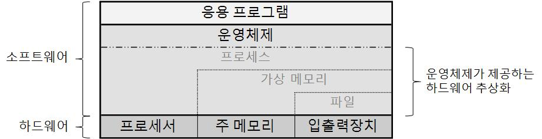
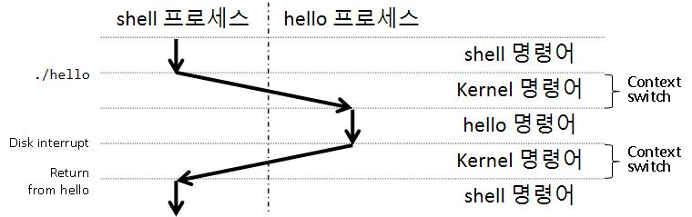
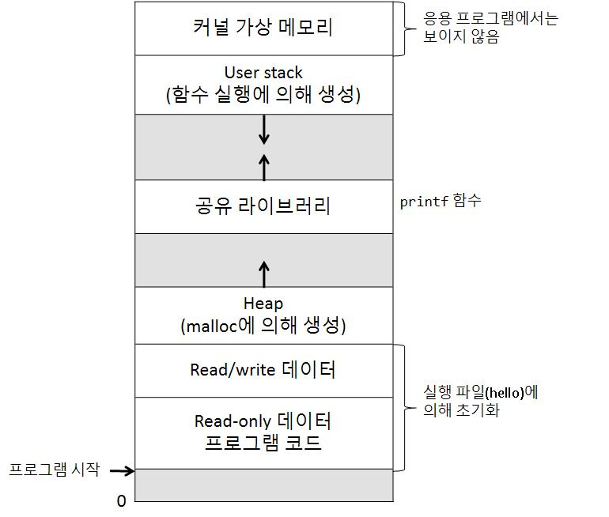

# 운영체제 두둥등장!

# 0. Battlecruiser operational


전 어렸을 때부터 잔병치레가 많았습니다. 유치원 2학년 때엔 뇌수막염에 걸려 여름 방학 내내 입원해 있었고, 초등학교 3학년엔 왼쪽 대퇴골에 종양이 생겨 몇 달을 병원살이를 했습니다. 때는 기억이 흐려 확실치 않으나, 언제는 아버지가 척추에서 골수를 뽑아내고 며칠을 누워있어 기운이 없던 절 이끌고 병원 1층 로비에 있던 컴퓨터로 데려가셨습니다. 그러고는 그 당시로도 느렸던 컴퓨터에 스타크래프트를 깔아 제게 게임을 시켜주셨죠. 그래도 되었는지는 모르지만 전 신경도 쓰지 못했습니다. 전 게임을 좋아하거든요. 그게 제 인생 첫 스타크래프트였습니다. 퇴원하고도 한참은 스타크래프트를 했던 기억이 있네요. 아빠는 단 한번도 못 이겼지만요.

그 게임에서 “배틀 크루저”라는 유닛이 있습니다. “테란”이라는 종족의 가장 쎈 캐릭터였죠. 게임을 시작하고 오래도록 버텨서 배틀 크루저의 생산 버튼을 누르고 한참을 기다리면, 중후한 목소리로 위엄있는 대사를 내뱉으며 그 거대한 함선이 모습을 드러냈습니다.

> *“Battlecruiser operational”  
> ”배틀 크루저 가동 준비 완료”*
> 

제 인생에서 처음으로 “Operate”라는 영단어를 들은 순간이었습니다. 그 순간의 기억이 너무 생생해서 아직까지도 저는 Operate라는 단어에 왠지 모를 울림을 느낍니다. 그래서 언젠가의 초등학교 정보 시간에 컴퓨터를 켜면 당연히 나타나던 윈도우가 OS(Operating System)란 종류의 프로그램이란 것을 듣고 나서는 컴퓨터를 켤 때 마다 윈도우가 제게 이렇게 말하는 듯 한 느낌이 듭니다.

> *“Computer operational”  
> ”컴퓨터 가동 준비 완료”*
> 

그 순간의 제 눈에 비치는 윈도우는 하드웨어를 완벽히 지휘하며 프로그래머가 내리는 명령을 수행할 준비를 마친, 절도 있는 함장의 모습입니다.

# 1. 운영 체제(Operating System)


우리가 전에 컴파일했던 hello 프로그램을 실행했을 때를 떠올려봅시다. 우리는 이런 명령줄을 shell에 입력했었죠.

```bash
> ./hello
```

그러면 우리의 hello 프로그램이 실행되며 화면에 문자열을 출력했습니다. 

그런데 생각 해봅시다. shell이 hello 프로그램을 읽어들이고 실행할 때 사용자(우리)가 직접 디스크와 메모리에 접근했나요? 아니죠. 사용자는 그저 명령줄을 입력한 것 외엔 한 것이 없습니다. 또한 우리가 hello 프로그램을 작성할 때 모니터에 직접적으로 접근하는 코드를 작성한 적이 없음에도, 우리의 hello 프로그램은 “알아서” 화면에 “hello, world\n” 문자열을 출력했습니다. 우리는 printf라는 이름의 함수를 호출한 것 뿐인데 말이죠.

당연하게도 컴퓨터가 “알아서” 이런 작업들을 해줄 리는 없습니다. 계속 말하지만 컴퓨터는 그냥 이진수 계산기니까요. 컴퓨터 시스템에 마법은 없습니다. 오직 과정을 모르면 신기한 일이라고만 받아들이는 마술만이 있을 뿐이죠. 그리고 이번 마술은, **운영체제(Operating System)**가 해당 작업들을 처리하고, shell과 우리가 작성한 hello 프로그램이 이에 의존하고 있기 때문에 가능한 마술입니다.

운영체제는 응용 프로그램과 하드웨어 사이에 위치한 하나의 프로그램 층으로 생각할 수 있습니다. 응용 프로그램의 모든 하드웨어로의 접근은 운영체제를 통과해야만 합니다.



운영체제는 두 가지의 주요한 목적을 가지고 있습니다. 하나는 프로그램의 잘못된 실행으로 인한 오류로부터 하드웨어를 보호하는 것이며, 두 번째는 응용 프로그램들에게 다양한 종류의 하드웨어에 접근할 수 있는 일관되고 간편한 방법을 제공하는 것입니다.

운영체제는 프로그래머에게 하드웨어에 대한 추상화를 제공하여 이 두 가지 목표를 이룹니다. 이 추상화란 위의 그림에 나와있는 프로세스, 가상 메모리, 파일을 의미합니다. **프로세스(process)**는 입출력 장치와 주 메모리, 그리고 프로세서에 대한 추상화, **가상 메모리(virtual memory)**는 입출력 장치와 주 메모리에 대한 추상화, **파일(files)**은 입출력 장치에 대한 추상화입니다. 각각에 대해 차근차근 알아봅시다.

## 1-1. 프로세스

운영체제는 어떤 프로그램을 실행할 때 마치 그 프로그램이 컴퓨터에서 유일하게 실행 중인 프로그램인 것처럼 보이게 해줍니다. 실제로는 음악을 틀어두고, 유튜브 영상을 보며, 창모드로 메이플스토리에서 레벨업 노가다를 뛰고 있는데도 말이죠. 이런 상황에서 뮤직 플레이어, 크롬, 메이플스토리 각각의 프로그램들은 자기 자신만이 컴퓨터의 프로세서, 주 메모리, 입출력 장치를 사용하는 것처럼 작동합니다. 각각의 프로그램 입장에서, 프로세서는 외부의 방해 없이 명령어를 하나하나 읽어가며 착실히 실행하고, 주 메모리에는 자신만이 로드되어 있는 것처럼 작동합니다. 이런 마술은 프로세스 덕분에 가능합니다.

프로그램의 실행 과정에 대해서는 이전에 살펴본 적이 있지요. **프로세스(process)**는 그러한 프로그램의 실행 과정 전체를 추상화한 결과물입니다. 프로세스는 컴퓨터 과학의 가장 중요하고 성공적인 아이디어 중 하나입니다. 프로세스 덕분에 여러 개의 프로그램을 서로에 대한 간섭을 걱정하지 않고 동시에 실행할 수 있게 되었기 때문이죠. 하나의 시스템에서 여러 개의 프로세스가 동시에 병렬적으로 실행될 수 있으며, 각각의 프로세스는 하드웨어를 배타적(exclusive)으로 사용하게 됩니다. 전체 컴퓨터 시스템에서 한 프로세스의 명령어들은 운영체제의 제어를 따라 다른 프로세스들의 명령어들과 교차되어 겹치지 않고 실행되며, 이를 **병행성(concurrency)**이라고 부릅니다. 이를 통해, 한 시스템에 CPU는 하나가 존재하더라도 그보다 많은 양의 프로세스를 동시에 실행하는 것이 가능합니다.

> 💡  
> 병행성과 비슷한 개념으로 병렬성(Parallelism)이라는 개념이 있습니다. 같은 이야기를 하는 듯 싶으나 미묘한 어감의 차이가 있습니다. 이는 이번 단원 말미에 다루어보도록 하겠습니다.


### 1-1-1. 문맥 교환(Context switching)과 커널(Kernel)

하나의 프로세서가 프로세스들 간의 교차적 실행을 통해 병행적으로 프로그램을 실행할 수 있다고 했죠. 이 교차적 실행은 운영체제의 **문맥 교환(context switching)**이란 작업을 통해 이루어집니다. 

운영체제는 프로세스 실행을 위해 필요한 모든 상태 정보들을 추적합니다. 이 상태 정보들은 **문맥(context)**이라 불리고, 여기에는 레지스터 파일들의 값, 주 메모리에 담긴 데이터들, 프로그램 카운터(PC)의 값 등이 포함됩니다. 언제가 되던, 하나의 프로세서는 하나의 프로세스의 명령어만 실행할 수 있습니다. 그러다가 운영체제가 현재 실행중인 프로세스에서 다른 프로세스로 제어권을 이양할 때, 현재 프로세스의 context들을 저장하고, 새로운 프로세스의 context를 복원하여 과거에 context를 저장했던 시기와 같이 context를 설정한 후, 새로운 프로세스로 제어권을 넘깁니다.

우리가 hello 프로그램을 실행시켰던 때로 돌아가봅시다. 처음에는 shell 프로세스가 실행되며 사용자의 입력을 기다리고 있었습니다. 우리가 hello 프로그램 실행을 요청하자, shell은 제어권을 운영체제로 넘깁니다. 제어권을 이양받은 운영체제는 shell의 context를 저장하고, 새롭게 hello 프로세스와 context를 생성한 후 hello 프로세스로 하드웨어 제어권을 넘깁니다. hello 프로세스 실행이 완료된 후에, 운영체제는 shell 프로세스의 context를 복원하고 제어권을 넘깁니다. 그러면 shell은 처음과 같이 사용자의 입력을 기다리는 상태가 되죠. 



위의 그림을 보면 context switching이 운영체제 **커널(kernal)**이란 것에 의해 수행되는 것을 확인하실 수 있습니다. 커널은 주 메모리에 상주하는 운영체제 코드의 일부입니다. 응용 프로그램이 운영체제가 파일을 읽고 쓰는 등의 특정 행동을 취하도록 요구할 때, **system call**이라는 특수한 함수를 실행합니다. system call을 실행하면 컴퓨터의 제어권은 커널로 넘어가게 됩니다. 그 후 커널은 요구된 명령을 수행하고, 다시 응용 프로그램으로 돌아갑니다.


> ⚠️  
> 커널을 운영체제 운용을 위한 가장 기초가 되는 프로세스로 생각하실 수도 있을 것 같습니다. 그러나 커널은 애초에 프로세스가 아닙니다. 커널은 모든 프로세스들의 관리를 위한 코드와 자료구조의 집합으로 이해되어야 합니다. 커널은 프로세스가 아니라는 것을 주의하시길 바랍니다.


### 1-1-2. 스레드(Threads)

여기까지 읽으면 운영체제가 직렬적 프로그램 흐름을 가지는 여러 개의 프로세스들을 가지고 있고, 프로세스의 명령어를 context switching을 통해 교차로 수행하여 병행적으로 프로그램을 한꺼번에 실행하는 것으로 보입니다. 그런데 사실 프로세스도 내부적으로 꼭 직렬적인 단일한 흐름을 가지고 있지만은 않습니다. 오늘날의 시스템들은 하나의 프로세스 안에서도 **스레드(Thread)**라 불리는 병렬적인 실행 흐름을 가지고 있을 수 있습니다. 이들은 같은 context 안에서 실행되기에 같은 코드와 전역 데이터들을 공유합니다.

스레드는 같은 context 안에서 실행되기에, 스레드 간의 데이터의 공유는 프로세스 간의 데이터 공유보다 쉽습니다. 또한 다중 스레드를 사용하여 다중 프로세스와 같이 프로그램이 더 빠르게 동작하도록 하는 것이 가능합니다. 더군다나 스레드 간의 context switching은 프로세스 간 context switching보다 더 빠르게 실행됩니다. 위에서 말했듯 같은 context 내에 존재하기에 switching에 필요한 작업이 적기 때문이죠.

## 1-2. 가상 메모리(Virtual Memory)

**가상 메모리(Virtual memory)**는 각 프로세스가 각자의 고유한 메모리를 가지는 것 같은 마술을 제공하는 하드웨어의 추상화입니다. 좀 더 구체적으로는 주 메모리와 입출력 장치의 추상화죠. 모든 프로세스는 **가상 주소 공간(Virtual address space)**이라는 메모리에 대한 동일한 틀을 가지게 됩니다.



리눅스 프로세스에서의 virtual address space는 위의 그림과 같은 구조를 가집니다. 가장 큰 메모리 주소를 가진 곳에는 모든 프로세스가 공유하는 운영체제의 코드와 데이터들이 있습니다. 그 아래에는 사용자 프로세스의 코드와 데이터들이 있죠.  virtual address space는 큰 덩어리로 나누면 다섯 부분으로 나눌 수 있습니다. 메모리 주소의 오름차순으로 각 구역들의 기능은 이렇습니다.

1. 프로그램의 코드와 데이터
    
    모든 프로세스의 코드가 시작되는 주소는 같은 고정된 값입니다. 또 코드 위에는 바로 전역 변수등이 저장되는 데이터 구역이 있죠. 이들은 실행 파일(우리의 hello같은 것들이죠)로부터 바로 초기화됩니다.
    
2. 힙(Heap)
    
    **힙(Heap)**은 run-time(런타임, 실행시간)에 동적으로 생성되는 변수를 위한 공간입니다. 프로세스 시작과 함께 크기가 정해지는 프로그램의 코드와 데이터를 위한 공간과 달리, 이 공간의 크기는 malloc, free함수의 실행에 따라 런타임에 확장되고 줄어들기를 반복합니다. 
    
3. 공유 라이브러리(Shared Library)
    
    C 표준 라이브러리나 수학 라이브러리들과 같이 자주 쓰이는 라이브러리들은 실행 프로그램에 포함시키면 프로그램의 크기가 너무 커지는 등의 문제로 인해 실행파일에 포함시키지 않고 사용할 라이브러리를 연결만 해두게 됩니다. 이런 라이브러리를 공유 라이브러리라고 하죠. 이 공간은 외부 공유 라이브러리들의 코드와 데이터들을 위한 공간입니다.
    
4. 스택(Stack)
    
    사용자의 virtual address space의 가장 위에는 **user stack**이 존재합니다. 이 공간은 함수 실행을 위한 공간이죠. Heap과 마찬가지로, stack은 런타임에 크기가 확장되고 줄어들기를 반복합니다. 단 이 공간은 함수 실행을 위한 공간이기 때문에, stack의 크기는 함수가 실행될 때 확장되고, 함수에서 return 할 때 줄어들게 됩니다.
    
5. 커널 가상 메모리
    
    이 공간은 커널을 위한 공간입니다. 응용 프로그램은 이 구역의 데이터를 직접 읽거나 쓰는것이 불가능합니다. 이 구역의 함수 실행 역시 불가능하죠. 응용 프로그램이 이 구역에 접근하기 위해서는 커널을 통과해야만 합니다. 응용 프로그램의 모든 하드웨어로의 접근은 운영체제를 통과해야 한다는 것을 기억하세요!
    

가상 메모리가 작동하기 위해서는 운영체제가 상당히 복잡한 일들을 처리하여 하드웨어를 제어해야 합니다. 모든 프로세서가 읽은 응용 프로그램에 적힌 주소값을 실재 하드웨어의 주소값으로 변환하는 등의 작업이 필요하죠. 가상 메모리의 구체적인 작동 방식에 대해서는 추후에 살펴보도록 합시다.

## 1-3. 파일(Files)

파일은 연속된 바이트들의 집합입니다. 그 이상도, 그 이하도 아니죠. 하지만 때로는 간단한 것이 강력한 법입니다. 컴퓨터 시스템의 모든 입출력은 파일을 읽고 쓰는것으로 수행된다고 해도 과언이 아니죠. 그것이 디스크던, 키보드건, 디스플레이이건, 네트워크이건 말이죠. 이러한 파일의 간단명료함은, 다양한 종류의 입출력 기기들을 동일한 틀로 접근하게 한다는 점에서 아주 강력합니다. 파일 덕분에 우리는 디스크에 파일을 저장할 때, 특정 디스크에 어떤 기술이 쓰였는지 걱정하지 않아도 됩니다.  더 나아가 다른 기술이 적용된 디스크에도 호환성을 걱정하지 않고 동일한 프로그램을 사용할 수 있죠.

# 2. 마무리


이번 글에서는 운영체제가 무엇이며, 이것이 하드웨어를 어떻게 추상화하는지 살펴보았습니다. Linux를 기준으로 한 내용들이지만 다른 운영체제들도 이와 비슷한 틀을 따릅니다. 그렇기에 “어 나는 윈도우에 관련해서 알아보고 싶은데!”라고 생각하셔도 이 곳에서 나온 내용들은 도움이 될 것입니다.

자! 정말로 이번 단원이 끝나갑니다. 이제 글 하나만 더 읽으면 이번 단원은 끝나겠네요. 조금만 더 힘냅시다! 다음 글에서는 특정한 주제에 대해 살펴보기 보다는, 컴퓨터 과학 역사에 있어 중요하고도 위대한 발상들 몇 개를 간단히 알아보도록 하겠습니다. 우리가 지금까지 본 컴퓨터의 기초적인 내용들을 넘어서, 오늘날의 아주 빠른 컴퓨터를 만들어낸 핵심 아이디어들이죠. 그럼 다음 글에서 뵙겠습니다!