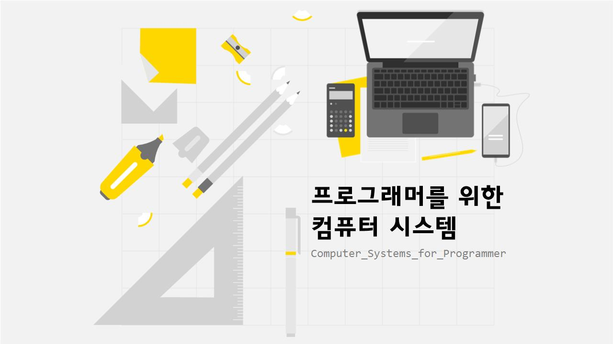

# 프로그래머를 위한 컴퓨터 시스템

# 머릿글

이 시리즈는 제가 『*Computer Systems: A Programmer's Perspective*』(이하 CSAPP)를 주로 하여 컴퓨터 시스템을 공부한 내용들을 정리하고, 여러분들과 공유하기 위해 쓰여졌습니다. 

## 왜 컴퓨터 시스템을 배워야 하죠?

적지 않은 프로그래머는 컴퓨터를 블랙박스로 취급합니다. 0과 1밖에 모른다는 것이 어떻게 억이 넘어가는 큰 수를 0부터 9까지나 아는 나보다 빠르고 정확하게 계산하는지, 양수는 물론이고 음수와 소수는 어떻게 계산하는지, 내가 문자로 저장한 코드를 어떻게 0과 1밖에 모르는 바보가 읽고 실행시키는지 등등... 이런 많은 궁금증들을 일단 덮어두고 코드를 짜다 보면 어느 순간 이런 생각이 듭니다.

> “아, 컴퓨터는 0과 1밖에 모르는 바보고, 나는 그것보다 조금 더 멍청하구나.”
> 

진정한 프로그래머라면 컴퓨터를 자기 수족과 같이 다루어야 하는데, 가끔 보면 컴퓨터가 내가 쓴 코드대로 움직여주지 않고 지 맘대로 움직이는 것 같은 경우가 있습니다. 가령 이런 경우들입니다.

> “어? 계속 0.0을 더하는데 왜 값이 점점 증가하지?”
> 

> “아니 타입 변환만 하는데 왜 이상한 숫자가 나오는거야?”
> 

> “아니 이 컴퓨터에선 되는데 왜 저 컴퓨터에선 안 되는거지...?”
> 

제 마음도 몰라주고 섭섭하죠. 이래서는 프로그램의 내부 구현을 모르고 프로그램을 사용하다 에러가 나면 “어? 왜 이래!” 만 연발하는 일반 사용자랑 다를 게 없습니다. 아니면 이런 경우도 있습니다.

> “극한의 성능이 필요한데.... 여기서 어떻게 코드를 더 빨리 돌아가게 하지?”
> 

> “메모리를 너무 잡아먹네.... 근데 이 프로그램이 이 정도로 메모리를 잡아먹을 프로그램인가?”
> 

컴퓨터의 작동 원리를 이해하는 것은 이런 질문들에 대한 답과 이정표가 되어줍니다. 또한 컴퓨터 시스템에 대한 지식들은 여러분들이 IT분야의 다른 지식을 배울 때 더 빠르고 깊게 지식을 흡수하도록 도와주는 IT 분야의 도메인 지식으로써 누구보다 강한 기본기를 가지도록 여러분들을 도울 것입니다.

자! 이제 컴퓨터 속으로의 여행만 남았습니다. 지금까지는 어둠에 싸여있던 그 속을 들여다볼 시간입니다. 가보죠, 진실을 향해 어둠을 해쳐!

## 선행지식

이 시리즈는 특정한 기술 스택이나 수학 등의 선행 지식을 가지고 있지 않아도 글을 읽는데 문제가 없도록 진행될 것입니다. 그러나 컴퓨터 시스템을 공부하는 데 있어서 실제 코드가 어떻게 작동하는지 파악하는 것은 여러분에게 큰 도움이 될 것이기에, 기초적인 수준의 C언어로 작성된 예제들이 종종 나올 것입니다. 또한 리눅스 환경에서 시리즈가 진행되기 때문에, 리눅스 환경에서 기초적인 C언어 프로그램을 작성한 경험이 한 번이라도 있다면 시리즈를 읽는데 전혀 문제가 없습니다.

## 이 시리즈를 읽는 법

이 시리즈는 같은 주제로 묶인 단원과, 각 단원 아래에 비슷한 소주제로 묶인 글로 구성되어 있습니다. 아래의 목차에서 단원들과 각 단원을 이루는 글들의 목록을 파악하실 수 있습니다.

컴퓨터 구조와 연이 없으신 분들은 이 시리즈의 입문 단원부터 차례로 읽어가시면 됩니다. 글의 순서는 이후 단원의 내용을 몰라도 앞의 단원을 이해하는데 문제가 없도록 위상 정렬된 순서로 작성될 것입니다.

컴퓨터 작동에 대한 기초적인 지식을 가지고 계신 분들은 입문 단원은 건너 뛰어도 됩니다. 입문 단원에서는 컴퓨터 작동 전반에 대해 대략적으로 다룬 후, 그 이후 단원에서 각 부분을 세부적으로 설명할 것이기 때문입니다.

특정한 주제에 대한 지식만 알아보고 싶으신 경우, 해당하는 단원만 읽으셔도 됩니다. 가능한 각 단원은 단원을 이루는 지식들의 응집도가 높게 작성하여, 이해를 위해 다른 단원을 읽어야 할 필요성을 최소한으로 유지하겠습니다.

>💡  
>글을 읽다 보면 이렇게 강조 표시가 된 부분을 만나시게 될겁니다. 강조 표시가 된 부분은 아이콘에 따라 그 의미를 구분하겠습니다. 여기처럼 💡 표시가 된 부분은 알아두면 좋은 지식들로, 컴퓨터 시스템 지식일 수도, 다른 분야의 지식일 수도 있습니다. 그러나 해당하는 지식들은 추후 컴퓨터 관련 지식들을 학습할 때 도움이 되거나, 이후의 글을 이해하는 데에 필요한 내용일 수 있습니다.

>❓   
> 이런 물음표 이이콘이 있는 부분은 글을 읽으며 들었을 법한 의문들과, 그에 대한 대답입니다. 또한 한 번 고민해 볼법한 문제들이죠. 답을 읽기 전에 스스로 한 번 고민해보고 답을 읽어도 좋습니다.

>⚠️  
>이 주의 아이콘이 있는 부분은 글을 읽었을 때 오해할 수 있을 만한 부분을 추가적으로 설명하는 부분입니다. 읽어보면서 혹시 자신이 잘못 이해한 것이 있나 생각해봅시다.

## 주의사항

해당 시리즈는 Linux 환경에서 gcc 컴파일러를 통해 진행합니다. 개인이 직접 코드를 작성하여 테스트를 할 경우 컴파일 과정에서 생성되는 어셈블리 코드, 바이너리 코드들은 개인의 컴퓨터 환경, 운영체제, 하드웨어, 소프트웨어 버전 등의 어려가지 변수로 인해 본 시리즈의 예제와 다르게 나타날 수 있습니다. 본 시리즈의 예제 코드들은 CSAPP 3차 개정판을 가능한 따라갈 것입니다.

## 저도 학생입니다

이 글을 쓰고 있는 전 여러분들과 마찬가지로 컴퓨터 시스템에 관심을 가지고 공부하는 많고 많은 학생들 중 하나입니다. 부정확한 지식들이 있을 수도 있으며, 어떤 지식들은 빛바랜 구시대의 지식일 수도 있습니다. 즉, 여러분들이 이 시리즈를 읽으시며 아래와 같은 생각이 드신다면,

> “어? 과연 그럴까?”
> 

> “어? 이건 사실과 다른데?”
> 

전혀 망설이지 마시고 그런 부분들을 의심하며, 틀린 부분이 있다면 공유해주시면 감사하겠습니다. 여러분들의 참여가 이 시리즈를 더욱 가치있게 만듭니다!

# 목차

| 번호 | 제목 | 단원 | 학습 목표 | 글 |
| --- | --- | --- | --- | --- |
| 01 | 프로그램? | [입문](./1-Introduction/README.md) | 비트(bit)와 컴파일 과정을 이해합니다 | [읽기](./1-Introduction/1-bit_and_compile/README.md) |
| 02 | 컴퓨터는 어떻게 프로그램을 실행하지? | [입문](./1-Introduction/README.md) | 명령어의 실행 과정을 이해합니다 | [읽기](./1-Introduction/2-executing_program/README.md) |
| 03 | 메모리가 CPU 따라가려다 다리 찢어집니다 | [입문](./1-Introduction/README.md) | 캐시 메모리와 메모리 계층 구조를 이해합니다. | [읽기](./1-Introduction/3-memory_hierachy/README.md) |
| 04 | 운영체제 두둥등장! | [입문](./1-Introduction/README.md) | 하드웨어의 추상화, 프로세스, 가상 메모리, 파일 등의 개념을 이해합니다  | 읽기 |
| 05 | 지적 개발을 위한 넓고 얕은 지식 | [입문](./1-Introduction/README.md) | 암달의 법칙, 병행성(Concurrency)과 병렬성(Parallelism), 추상화에 대해 이해합니다.  | 읽기 |
|  | 작성중... |  |  |  |
